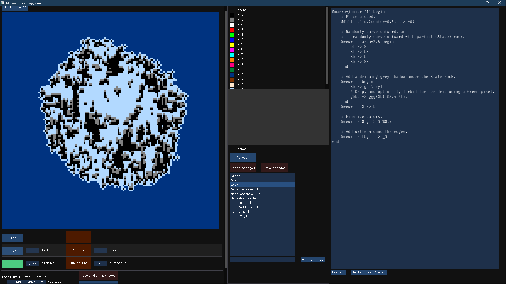

# MarkovJunior.jl

A Julia reimagining of [this awesome procedural generation algorithm](https://github.com/mxgmn/MarkovJunior/),
  able to generate in any number of dimensions.
It can build into several things:

* A standalone executable running a GUI playground for testing scenes
* A C-like DLL for other programs to integrate with
* A standalone executable exposing the DLL interface through an IPC protocol (to avoid DLL hell).

> ***NOTE**: The IPC approach is strongly recommended over the DLL one!*

[A plugin to integrate with Unreal Engine 5 is ongoing](https://github.com/heyx3/JMarkovJunior_Unreal5Demo).

````julia
# In the Julia REPL:
] add MarkovJunior
using MarkovJunior
markovjunior_run_gui()
````



[](https://www.youtube.com/watch?v=_I9aU8Ad-tE)

*A YouTube video demo*

Lots of nice features have already been implemented:

* A terse yet broadly-featured language (referred to as the "DSL", short for Domain-Specific Language)
* Numerous hooks to extend the DSL with your own features
* Both 2D and 3D rendering of scenes
* Any-dimensional rewrite rules with complex symmetry specification
* Building to standalone exe and/or DLL, so it can be used almost anywhere

[The DSL specification is available here](docs/dsl.md).

Math, GUI, and rendering are all built on top of my [game framework, **B+**](https://github.com/heyx3/B-plus).

## Why higher-dimensional grids?

I decided to support any-dimensional grids, mainly because it was cool and Julia makes it feasible.
However there are real, if underexplored, benefits:

* You can add a Time axis to the grid to get animated output.
* You can add an extra axis to store multiple pixels of data behind each output pixel, like temp variables.
* You could use it to foster logical connections between disparate areas of the grid,
  by connecting them through the extra dimensions.

If you have any thoughts on higher-dimensional tricks, share them in a Github Issue!

## Usage

Specific algorithms are written as [a new Julia macro `@markovjunior`](docs/dsl.md).
If you execute this macro in a Julia environment you get a `MarkovAlgorithm` instance.

### Directly in Julia

If you have the `@markovjunior ...` macro as a string (e.g. from a file),
  call `markov_algo_parse(str)`.
You can also convert it back to a string with `markov_algo_to_string(algo)`,
   but be aware that cosmetic details get lost in the translation.

To start running an algorithm on a new grid, call `state = markov_algo_start(algo, (32, 32), 0xababcdef)`.
The second argument is the grid size (as many dimensions as you want), and the third is the RNG seed
  (you can provide multiple within a tuple).

Iterate on the state with `markov_algo_step(algo, state)`.
You may pass an iteration count as the third parameter;
  operations are more efficient when running multiple steps at once.
You can also call `markov_algo_finish(algo, state)` to immediately run to completion,
  but be careful your algorithm isn't an infinite loop!

Check on a running algorithm's state with `markov_algo_is_finished(algo, state)`.
Get the grid being operated on with `markov_algo_grid(state)::Array{UInt8}`.

Run the GUI tool by calling `markovjunior_run_gui()`.
Run the IPC service by calling `markovjunior_run_ipc(block_calling_thread::Bool)`.

### Through the IPC

IPC is preferred to using the package as a DLL, because Julia pulls in many sub-sub-dependencies and causes DLL hell.
Especially when working in a large codebase like Unreal Engine!

Our IPC server communicates using a "named pipe", a fast OS feature for communication between processes.
Named pipes are a two-way binary stream; extemely similar to TCP sockets but more efficient and not networked.
Provided with the IPC executable is a C header, C++ header, and JSON file, containing all relevant constants.
The most important constant is the name of the pipe, also stored in Julia under `MarkovJunior.IPC_PIPE_PATH`.

The executable has several command-line arguments which you can read by passing `--help`.
It will also write two signals to stdout, as 4-byte uints:
  a "start" code when the named pipe is ready for clients,
  and a "stop" code when it's no longer accepting clients (happens after you send a kill message).
Once all clients are gone *and* it's no longer accepting new ones, the process dies naturally.

> *The IPC protocol is perfectly functional but still subject to change.*
> *The pipe name has a number on the end of it, which will be incremented every time a breaking change is made.*

Currently each client's algo states and parsed algorithms are **not** automatically cleaned up when they disconnect!

#### IPC Protocol

The exact protocol for talking across the pipe is as follows,
  and you can also reference the IPC functions in our unit test *test/ipc.jl*.

1. The initial handshake is to send the server your cosmetic "client name", in UTF-8 encoding.
It's only used for logging and does not have to be unique.
The null-terminator is optional -- Julia doesn't need it but we accept C-like strings.
   1. Send a 4-byte uint for the byte-size of the name.
   2. Send the bytes of the client name.
2. Now enter a loop of sending messages. For each message:
   1. Write a 4-byte uint representing the message type.
   2. Write any parameters the specific message expects.
   3. Read a 1-byte bool (0 or 1) indicating whether the message succeeded.
If it failed, something was wrong with your parameters.
   4. If success, read any output data from the message.
   5. If failure, most messages write nothing else, however a few will output an error string:
      1. Read a 4-byte uint for the string length
      2. Read the string bytes, encoded as UTF-8 *with* a null-terminator.
3. When you are finished, simply close the connection from your side.

The protocol for each message is as follows.
They are numbered by the message's ID, for example you send `1` to initiate the first message in the list.

1. **Parse a new algorithm**
   1. Write a 4-byte uint for the length of the string containing the algorithm
  (UTF-8 with optional null-terminator).
   2. Write the bytes of that string.
   3. Read the success flag.
   4. If it succeeded, read a 4-byte uint representing the parsed algorithm's unique ID.
   5. If it failed, read an error message string (protocol mentioned above).
2. **Destroy a parsed algorithm**
   1. Write a 4-byte uint representing the algorithm's ID.
   2. Read the success flag.
3. **Start running an algorithm** (there's no limit on running multiple simultaneously)
   1. Write a 4-byte uint representing the algorithm's ID.
   2. Write a 4-byte uint representing the number of grid dimensions.
   3. For each grid dimension, write a 4-byte uint representing its resolution along that axis.
   4. Read a success flag for whether a grid of that size is allowed. If not, skip the rest of this message.
   5. Write a 1-byte uint bool for whether you are providing an initial grid state.
   6. If you are, now write that grid state. This should have the same memory order as when you download a grid (see below).
   7. Write a 4-byte uint representing the number of bytes used to seed the RNG.
   8. Write the bytes of the RNG seed.
   9. Read the success flag.
   10. If it succeeded, read a 4-byte uint representing the ID of the new algo state.
4. **Destroy an algorithm run**
   1. Write a 4-byte uint representing the algorithm's ID.
   2. Write a 4-byte uint representing the algo state's ID.
   3. Read the success flag.
5. **Step an algorithm run forward**
   1. Write a 4-byte uint representing the algorithm's ID.
   2. Write a 4-byte uint representing the running state's ID.
   3. Write a 4-byte uint representing how many iterations to run.
   4. Read the success flag.
   5. If it succeeded, read a 1-byte bool (0 or 1) representing whether the algorithm is finished running.
6. **Run an algorithm to completion**
   1. Write a 4-byte uint representing the algorithm's ID.
   2. Write a 4-byte uint representing the running state's ID.
   3. Read the success flag.
7. **Query whether an algorithm is finished**
   1. Write a 4-byte uint representing the algorithm's ID.
   2. Write a 4-byte uint representing the running state's ID.
   3. Read the success flag.
   4. If it succeeded, read a 1-byte bool (0 or 1) representing whether the algorithm is finished running.
8. **Download the current state of the algorithm grid**
   1. Write a 4-byte uint representing the running state's ID.
   2. Read the success flag. The rest of the steps only apply if successful.
   3. Read a 4-byte uint representing the number of dimensions of the grid.
  This will match what you originally passed when starting the run.
   4. For each grid dimension, read a 4-byte uint representing the resolution along that axis.
  This *may not* match the original size you started with, depending on what your algorithm does!
   5. Read the bytes of the grid.
  Each pixel is one byte so the total byte-count is the product of the grid's resolution along each axis.
  The first axis (X) is the innermost.
1. **Stop accepting new clients to the service** (must tell the server to support this when starting up)
   1. Read the success flag.
Note that multiple clients can receive success; it only fails if the server does not allow the message.
   1. If running this service through the standalone executable,
  then the process dies once all existing clients have disconnected.

## Scenes

Many algorithms can be found in the *scenes/* folder.
They are heavily commented to help you learn.

## Optimizing the standalone builds

**This section is for anyone who really wants to integrate the DLL release directly into a project.**
**You should prefer the IPC executable instead.**

Due to Julia's unique JIT architecture, it essentially needs a whole compiler inside its runtime.
Due to our GUI tool, there are many sub-sub-dependencies compiled into the package.
As a result the executable and dll are much larger than is ideal and also don't play well with mobile.
Addtionally if you have any other Julia packages that you'd like to use,
  you'd need to manage multiple copies of julia across multiple libraries!

The way to get around these problems is to make a new Julia package,
  taking ours and any others you want as dependencies,
  then building a new library in the same way we build ours.

Such a package could also precompile particular use-cases for your project,
  like pre-parsing all the specific algorithm instances you plan to run.
This removes the JIT overhead of running each MarkovJunior algorithm for the first time,
  and *that* opens up the door to a static only-AoT-compiled build
  which is mobile-friendly!
Unfortunately AoT Julia builds are still uncommon and a bit of an open problem AFAIK.

If you don't need the GUI tool, cut it and its dependencies out to greatly simplify the dependency tree.
In particular the `Bplus` dependency could be reduced to just `BplusCore`,
  with one or two changes to our package source to accomodate.
We have future plans to automate this.

When building your library, I recommend passing `filter_stdlibs=true` in to PackageCompiler.jl
  to shrink things even further; just look out for runtime crashes due to missing libs.
They can be fixed by adding those libs as a direct dependency.

## Development

On the main branch, this package uses the main branch of B+ (and its sub-packages).
So you should clone BplusCore, BplusApp, BplusTools, and Bplus,
  then run the following from the Julia REPL:

````julia
# Add local B+ sub-packages to B+
] activate ../Bplus.jl
] dev ../BplusCore.jl ../BplusApp.jl ../BplusTools.jl
# Add local B+ to MarkovJunior
] activate .
] dev ../Bplus.jl
````

### Building standalone binaries

We use the standard Julia project *PackageCompiler.jl* to compile the three main products:

* Executable running the GUI tool
* C-like DLL to use the core library features, plus a C/C++ header
* Executable exposing the DLL functionality through an IPC protocol, plus data files to provide important constants

The build pipeline is encapsulated in *scripts/compile_standalone.jl*.
Simply run that script with either `-exe` or `-dll` (both exe's are produced at once).

### `nvpatch` workaround

In the GUI tool, due to the use of *Bplus.jl*, we need to run on discrete GPU's instead of integrated ones.
The best way to ensure graphics drivers know this is to export specific constants in the compiled executable.
Unfortunately there's no way to do that through *PackageCompiler.jl*, so we use an external tool
  [called `nvpatch`](https://github.com/toptensoftware/nvpatch).

If you build this project into an executable without `nvpatch` installed, you'll get a stern warning.
Users of the GUI tool will have to force the discrete GPU themselves
    through Nvidia's Control Panel (or AMD's equivalent) to avoid errors on tool startup.

### Linking with the dll: `GenLibFromDll`

PackageCompiler generates a DLL for us, [but not the .lib file](https://github.com/JuliaLang/PackageCompiler.jl/issues/687) needed to link it to our headers!
Fortunately it is possible to *generate* a .lib by examining what's exposed in the dll and working backwards.
So, after compilation we use a tool which does exactly this: [GenLibFromDll](https://github.com/KHeresy/GenLibFromDll).
A specific version is directly embedded in this repo under the *scripts/* folder, to prevent link rot.

`GenLibFromDll` depends on Visual Studio Build Tools, so you need those installed.
If you don't have them (or are building for a different OS) you'll get a descriptive error message,
  warning you that there is no easy way for users to link with the DLL.

### Testing

Unit tests use the usual Julia convention of running *test/runtests.jl*.
This script invokes multiple other test scripts in the same folder.

Not all functionality is tested through unit tests, as the sample scenes already use many basic features,
  however certain featues are considered very important to unit-test.